## Introduction

Statistics versus Machine Learning (ML) when presented with a new dataset / problem

## Context of Assumptions
* Statisticians begin by making assumptions and modeling these to determine how the data was generated.
* ML people use algorithmic models where the data generation is treated as an unknown.

## Which is best ?
* Downsides to both and key question is making good predictions:
  * ML is data doesn't fit the model .... next please!
  * Complexity of the data creates more complex models (in terms of interpretability & of computation) hence in Stats trend to Bayesian MCMC.

--- .class #id

## Taking a 50,000 feet view of Machine Learning

* Machine Learning seeks to provide classifiers that can approximate targets or desired parameter/s when given a sufficient large training set.
* Typically, you will provide a data set and split it into a _training_ and a _test_ sub-sets to develop the classifiers.
* The resulting classifier/s can then be used on new data to predict the desired parameter/s based on the earlier data.

##  Downsides to Machine Learning
* ML approaches can be opaque to non-experts (Black-boxes)
  * It is impossible to explain the behavior of such a system.
* Academic quantitative measures not well matched to reality (e.g. _precision_, _recall_, _RMS error_, _etc_.)

--- .class #id

## Into the Forest - CART (classification and regression trees)
* Why should you use them?
* How can you interprest their results?
* What are they good at?
* A brief tour of the packages in R

## Why should you use them ?
1. Classification and Regression can be difficult to visualize and convey the meaning of to non-experts
2. They work well with categorical (Classification) or continuous (Regression) variables
3. You can use ensemble learning methods to improve results (e.g. Random Forest)
4. They can be used on longitudinal studies / data

--- .class #id

## How can you interpret their results?
* Confusion Matrices or contingency tables are used present the positive / negative classification results and are the basis for a ROC curve
   * true positive (TP - a hit), true negative (TN - a correct rejection), false positive (FP - negative but classified as positive, a false alarm, Type I error) and false negative (FN - positive but classified as negative, a miss, Type II error)
    * Positive/Negative refers to Prediction
    * True/False refers to Correctness
* ROC curves are a technique from signal detection theory that presents the balance between the hit rate and the false alarm rate of a classifier
  * What is the best threshold to distinguish between the absence of presence of a given signal
  * Dependant on the i) the signal's strength, ii) noise variance, and iii) the false alarm rate or the desired hit rate
* AUC or area under the curve, maps a ROC to a single scalar value. A classifier's AUC is equvivlent to the probability that it will rank a random positive instance higher than a random negative instance

--- &twocol

## Interpreting A Confusion Matrix

*** left

 

*** right

  * TPR or True Positive Rate = TP / Pos = TP/TP+FN
  * FPR or False Positive Rate = FP / Neg = FP/FP+TN
  * ACC or Accuracy = Pos * TPR + Neg * (1-FPR), This is the weighted average of true positive and true negative rates

--- &twocol
## Interpreting A ROC Plot

*** left

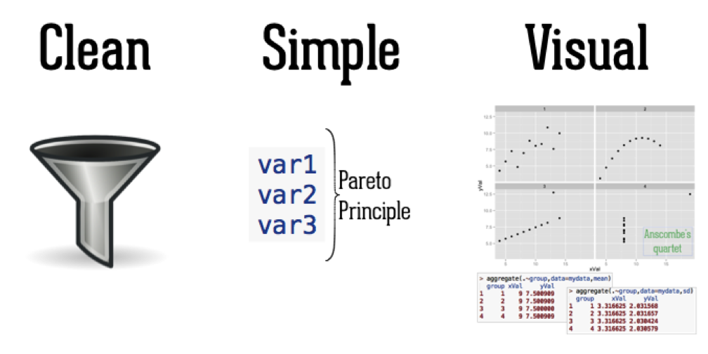 

*** right

  - A point in this plot is better than another if it is to the northwest (TPR higher / FPR lower / or both)
  - ``Conservatives'' - on LHS and near the X-axis - only make positive classification with strong evidence and making few FP errors but low TP rates
  - ``Liberals'' - on upper RHS - make positive classifications with weak evidence so nearly all postivies identified however high FP rates

--- &twocol

## Addressing Prediction Error

*** left

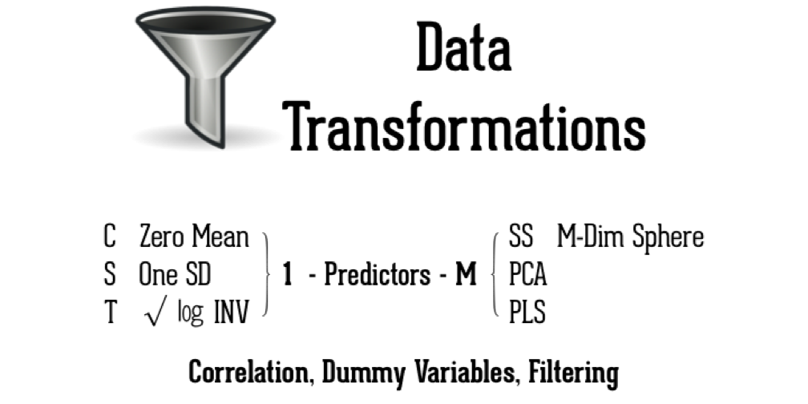 

*** right
* K-fold Cross-Validation (e.g. 10-fold) 
  * Allows for averaging the error across the models
* Bootstrapping, draw B random samples with replacement from data set to create B bootstrapped data sets with same size as original. These are used as training sets with the original used as the test set.
* Other variations on above:
  * Repeated cross validation
  * The '.632' bootstrap

--- .class #id

## Model Selection

* Validation process using optimization procedure or a simple grid search over set of values for models to examine different tuning parameters
* Criteria for selection can be overall accuracy or to simplest within one standard error of accuracy of the best / within X% of the best model or to most important features where there are many predicator variables.

## Model Assessment

* Given the tuning parameters/features the performance should be examined on the test set. In classification problems, it is useful to look beyond the accuracy measure for performance, particularly if the classes are unbalanced. Different models can be combined to create a better classifier using an ensemble of models.

## caret Package
* Really useful as steamlines model building and evaluation as well as feature selection plus a number of other tasks in classifier creation.

--- .class #id

## Aside - How do decision trees work ?
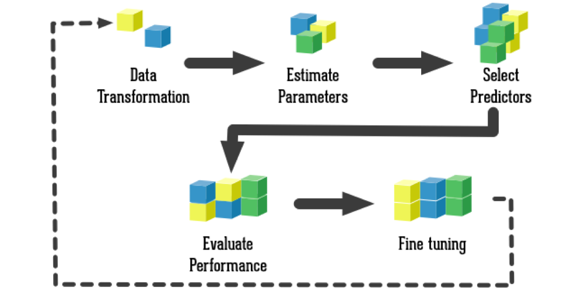 

--- &twocol
## What are they good for ?
### A - Car Insurance Policy Explosure Management - Part 1

*** left

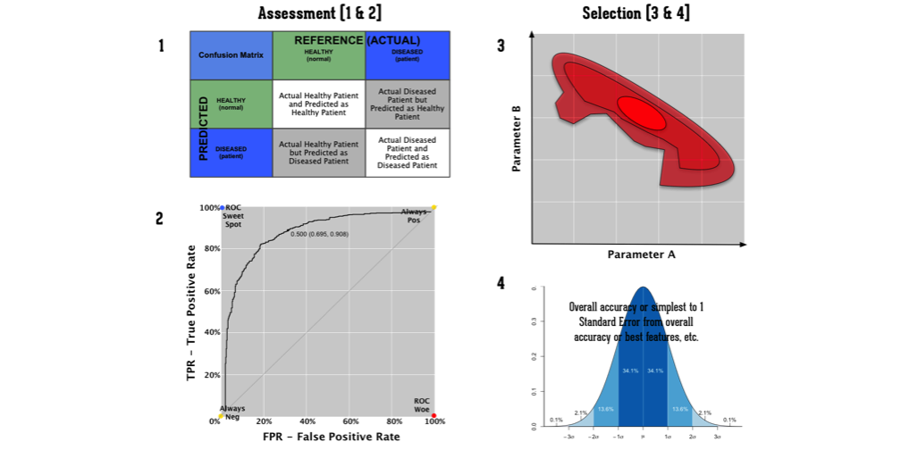 

*** right
* Analysing insurance claim details of 67856 policies taken out in 2004 and 2005 (using ctree, "1-Car-ctree-singletree.R")
* The model maps each record into one of X mutually exclusive terminal nodes or groups
* These groups are represented by their average response, where the node number is treated as the data group
* The binary claim indicator uses 6 variables to determine a probability estimate for each terminal node determine if a insurance policyholder will claim on their policy

--- &twocol
### A - Car Insurance Policy Explosure Management - Part 2

*** left

 

*** right
* Root node, splits the dataset on 'agecat'
* Younger drivers to the left (1-8) and older drivers (9-11) to right
* N9 splits on basis of vehicle value
* N10 <= $28.9k giving 15k records and 5.4% of claims
* N11 > $28.9k+ giving 1.9k records and 8.5% of claims
* Left Split from Root, N2 splits on vehicle body type, on age (N4), then on vehicle value (N6)
* The n value = num of overall population and the y value = probability of claim from a driver in that group

--- &twocol
## What are they good for ?
### B - Cancer Research Screening - Part 1

*** left

 

*** right

* Hill et al (2007), models how well cells within an image are segmented, 61 vars with 2019 obs (Training = 1009 & Test = 1010)
  * "Impact of image segmentation on high-content screening data quality for SK-BR-3 cells, Andrew A Hill, Peter LaPan, Yizheng Li and Steve Haney, BMC Bioinformatics 2007, 8:340"
    * b, Well-Segmented (WS)
    * c, WS (e.g. complete nucleus and cytoplasmic region)
    * d, Poorly-Segmented (PS)
    * e, PS (e.g. partial match/es)

--- &twocol
### B - Cancer Research Screening - Part 2

*** left
#### "prp(rpartTune$finalModel)"
 

*** right
#### "fancyRpartPlot(rpartTune$finalModel)"
 

--- &twocol
### B - Cancer Research Screening - Part 3

*** left

 

*** right

 

--- &twocol
## What are they good for ?
### C - Predicting the Quality of Wine - Part 1

*** left

* Cortez et al (2009), models the quality of wines (Vinho Verde), 14 vars with 4898 obs (Training = 5199 & Test = 1298)
* "Modeling wine preferences by data mining from physicochemical properties, P. Cortez, A. Cerdeira, F. Almeida, T. Matos and J. Reis, Decision Support Systems 2009, 47(4):547-553"
  * Good (quality score is >= 6)
  * Bad (quality score is < 6)

*** right

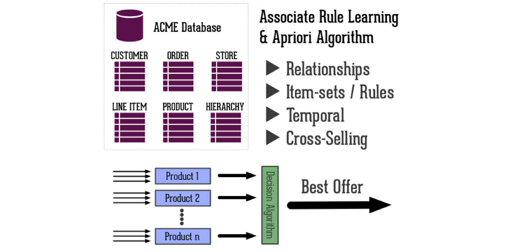 

--- &twocol
### C - Predicting the Quality of Wine - Part 2

*** left

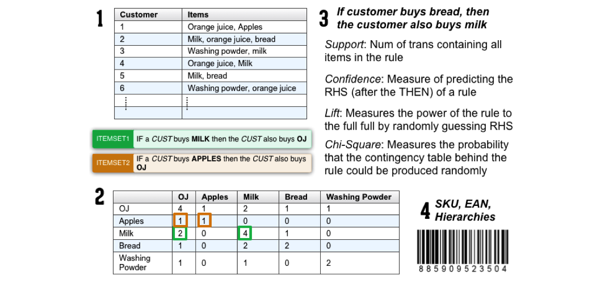 

*** right

 

--- &twocol
### C - Predicting the Quality of Wine - Part 3 - Beyond trees

*** left
* Deal with irrelvant inputs
* No data preprocessing required
* Scalable computation (fast to build)
* Tolerant with missing values (little loss of accuracy)
* Only a few tunable parameters (easy to learn)
* Allows for human understandable graphic representation

*** right
* Data fragmentation for high-dimensional sparse dataset (overfitting)
* Difficult to fit to a trened / piecewise constant model
* Highly infleuenced by changes to the dataset and local optima (deep trees might be questionable as the errors propagte down)

--- .class #id

## Aside - How does a random forest work ?
 

--- &twocol
### C - Predicting the Quality of Wine - Part 4 - Random Forest

*** left

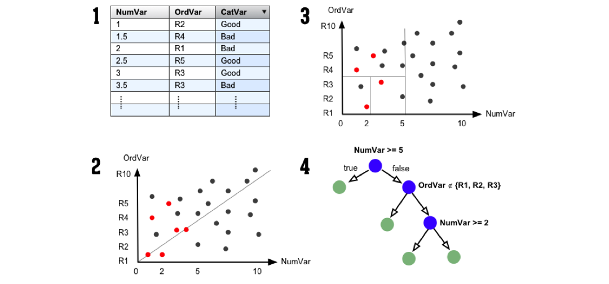 

*** right

 

--- &twocol
### C - Predicting the Quality of Wine - Part 5 - Other ML methods

*** left
*  K-nearest neighbors
  * Unsupervised learning / non-target based learning
  * Distance matrix / cluster analaysis using Euclidean distances.
* Neural Nets
  * Unsupervised learning / non-target based learning
  * Distance matrix / cluster analaysis using Euclidean distances.

*** right
* Support Vector Machines
  * Supervised learning
  * Distance matrix / cluster analaysis using Euclidean distances.

--- .class #id

## Aside - How does k nearest neighbours work ?
 

--- &twocol
### C - Predicting the Quality of Wine - Part 6 - kNN

*** left

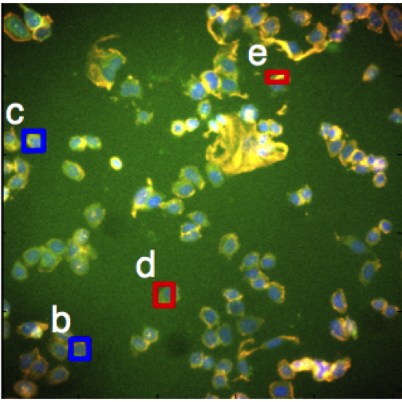 

*** right

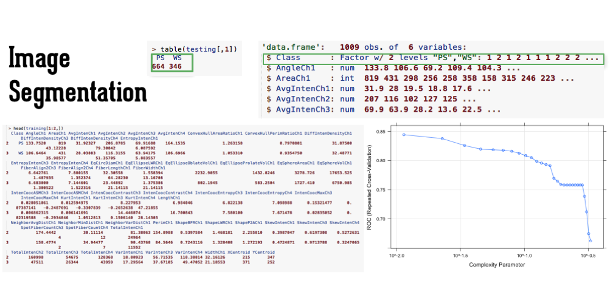 

--- .class #id

## Aside - How do neural networks work ?
 

--- &twocol
### C - Predicting the Quality of Wine - Part 7 - NNET

*** left

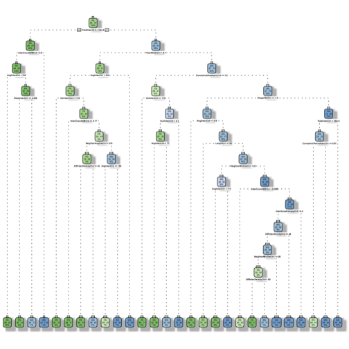 

*** right

 

--- .class #id

## Aside - How do support vector machines work ?
 

--- &twocol
### C - Predicting the Quality of Wine - Part 8 - SVN

*** left

 

*** right

 

--- &twocol
### C - Predicting the Quality of Wine - Part 9 - All Results

*** left

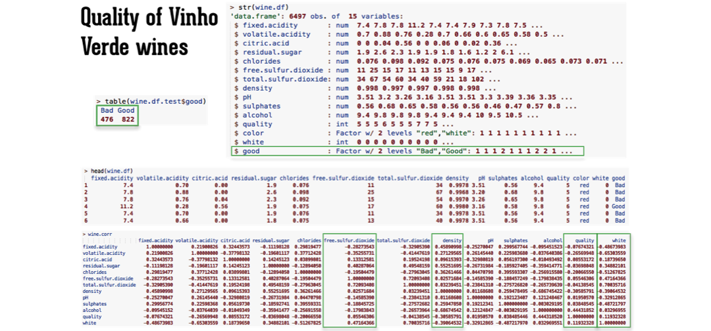 

*** right

 

--- &twocol
## Other related tools: OpenRefine (formerly Google Refine) / Rattle

*** left

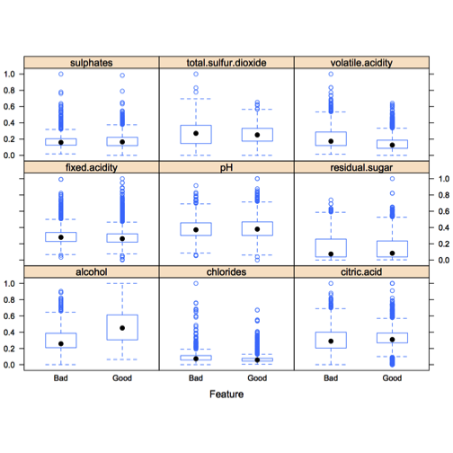 

*** right

 

--- &twocol
## Other related tools: Command Line Utilities

*** left
* [http://www.gregreda.com/2013/07/15/unix-commands-for-data-science/](http://www.gregreda.com/2013/07/15/unix-commands-for-data-science/)
  * sed / awk
  * head / tail
  * wc (word count)
  * grep
  * sort / uniq
* [http://blog.comsysto.com/2013/04/25/data-analysis-with-the-unix-shell/](http://blog.comsysto.com/2013/04/25/data-analysis-with-the-unix-shell/)
  * join
  * Gnuplot

*** right
* [http://jeroenjanssens.com/2013/09/19/seven-command-line-tools-for-data-science.html](http://jeroenjanssens.com/2013/09/19/seven-command-line-tools-for-data-science.html)
  * [http://csvkit.readthedocs.org/en/latest/](csvkit)
  * [https://github.com/jehiah/json2csv](json2csv)
  * [http://stedolan.github.io/jq/](jq - sed for json)
  * [https://github.com/jeroenjanssens/data-science-toolbox/blob/master/sample](sample)
  * [https://github.com/bitly/data_hacks](bitly command line tools)
  * [https://github.com/jeroenjanssens/data-science-toolbox/blob/master/Rio](Rio - csv to r to graphic output)
  * [https://github.com/parmentf/xml2json](xml2json)

--- &twocol
## A (incomplete) tour of the packages in R

*** left
* caret
* party
* rpart
* rpart.plot
* AppliedPredictiveModeling
* randomForest
* corrplot

*** right
* C50
* pROC
* corrplot
* kernlab
* rattle
* RColorBrewer
* corrgram

--- .class #id

## In Summary

### An idea of some of the types of classifiers available in ML.

### What a confusion matrix and ROC means for a classifier and how to interpret them

### An idea of how to test a set of techniques and parameters to help you find the best model for your data

### Slides, Data, Scripts are all on GH at https://github.com/braz/DublinR-ML-treesandforests

