---
title       : DublinR - Machine Learning 101
subtitle    : Introduction with Examples
author      : Eoin Brazil - https://github.com/braz/DublinR-ML-treesandforests
job         : 
framework   : io2012        # {io2012, html5slides, shower, dzslides, ...}
highlighter : highlight.js  # {highlight.js, prettify, highlight}
hitheme     : tomorrow      # 
widgets     : []            # {mathjax, quiz, bootstrap}
mode        : selfcontained # {standalone, draft}
--- 


## Machine Learning Techniques in R  

### A bit of context around ML 

### How can you interpret their results?  

### A few techniques to improve prediction / reduce over-fitting  

### Kaggle & similar competitions - using ML for fun & profit

### Nuts & Bolts - 4 data sets and 6 techniques

### A brief tour of some useful data handling / formatting tools  


--- .class #id

## A bit of context around ML
 


--- .class #id

## Model Selection and Model Assessment
 


--- &twocol

## Interpreting A Confusion Matrix

*** left

 


*** right

  * TPR or True Positive Rate = TP / Pos = TP/TP+FN
  * FPR or False Positive Rate = FP / Neg = FP/FP+TN
  * ACC or Accuracy = Pos * TPR + Neg * (1-FPR), This is the weighted average of true positive and true negative rates

--- &twocol
## Interpreting A ROC Plot

*** left

 


*** right

  - A point in this plot is better than another if it is to the northwest (TPR higher / FPR lower / or both)
  - ``Conservatives'' - on LHS and near the X-axis - only make positive classification with strong evidence and making few FP errors but low TP rates
  - ``Liberals'' - on upper RHS - make positive classifications with weak evidence so nearly all positives identified however high FP rates

--- &twocol

## Addressing Prediction Error

*** left

 


*** right
* K-fold Cross-Validation (e.g. 10-fold) 
  * Allows for averaging the error across the models
* Bootstrapping, draw B random samples with replacement from data set to create B bootstrapped data sets with same size as original. These are used as training sets with the original used as the test set.
* Other variations on above:
  * Repeated cross validation
  * The '.632' bootstrap


--- .class #id

## Addressing Feature Selection
 


--- .class #id

## Kaggle - using ML for fun & profit
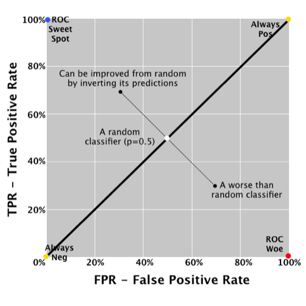 


--- .class #id

## Nuts & Bolts - Data sets and Techniques
 


--- .class #id

## Associative rule learning
* Discovery of interesting relations between variables in large databases. It is intended to identify strong rules discovered in databases using different measures of interestingness

* Apriori algorithm, which supports pruning of candidate rules to systematically control the exponential growth that occurs with this approach

* The algorithm finds subsets which are common with at least a minimum number of X of the itemsets and checks the frequent subsets and extends them one item at a time to find candidate rules which are then tested against the data

* Uses of association analysis
  * Sales patterns (Promotions vs. Sales, Direct Marketing / Geographical, Seasonal Differences)
  * Cross-selling
  * Extend it with time aspects to do longitudinal / sequential pattern analysis

--- .class #id

## Aside - How does associative analysis work ?
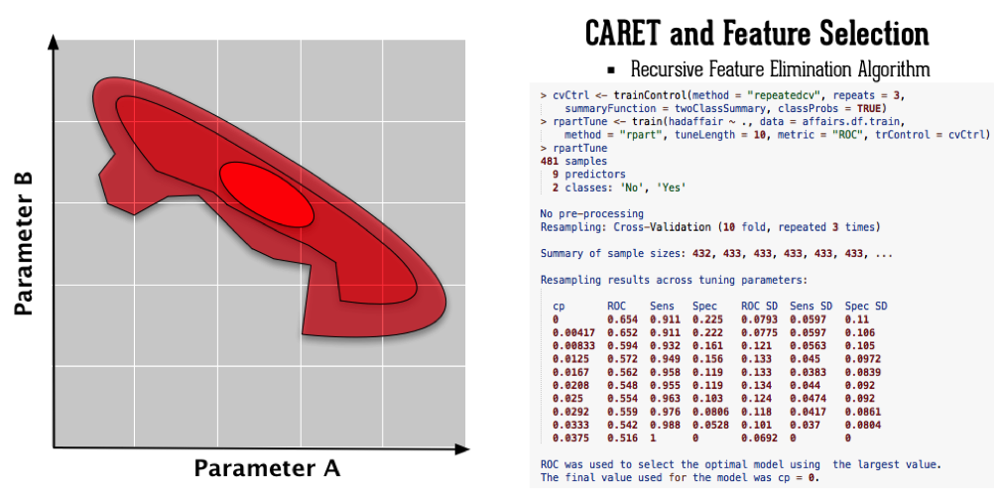 


--- .class #id
## What are they good for ?
### Marketing Survey Data - Part 1

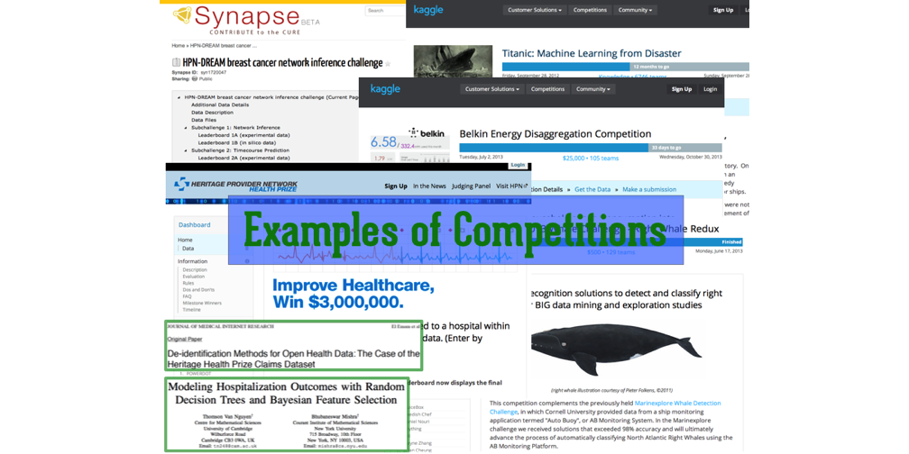 


--- .class #id
### Marketing Survey Data - Part 2

 


--- .class #id

## Aside - How do decision trees work ?
 


--- &twocol
## What are they good for ?
### Car Insurance Policy Exposure Management - Part 1

*** left

 


*** right
* Analysing insurance claim details of 67856 policies taken out in 2004 and 2005.
* The model maps each record into one of X mutually exclusive terminal nodes or groups.
* These groups are represented by their average response, where the node number is treated as the data group.
* The binary claim indicator uses 6 variables to determine a probability estimate for each terminal node determine if a insurance policyholder will claim on their policy.


--- &twocol
### Car Insurance Policy Exposure Management - Part 2

*** left

 


*** right
* Root node, splits the data set on 'agecat'
* Younger drivers to the left (1-8) and older drivers (9-11) to right
* N9 splits on basis of vehicle value
* N10 <= $28.9k giving 15k records and 5.4% of claims
* N11 > $28.9k+ giving 1.9k records and 8.5% of claims
* Left Split from Root, N2 splits on vehicle body type, on age (N4), then on vehicle value (N6)
* The n value = num of overall population and the y value = probability of claim from a driver in that group

--- &twocol
## What are they good for ?
### Cancer Research Screening - Part 1

*** left

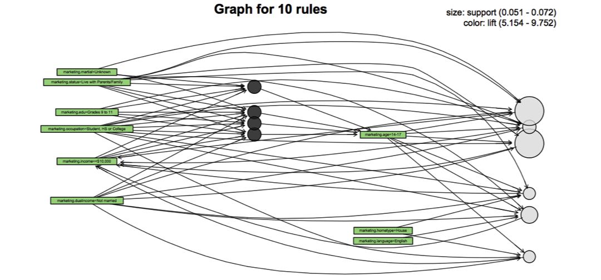 


*** right

* Hill et al (2007), models how well cells within an image are segmented, 61 vars with 2019 obs (Training = 1009 & Test = 1010).
  * "Impact of image segmentation on high-content screening data quality for SK-BR-3 cells, Andrew A Hill, Peter LaPan, Yizheng Li and Steve Haney, BMC Bioinformatics 2007, 8:340".
    * b, Well-Segmented (WS)
    * c, WS (e.g. complete nucleus and cytoplasmic region)
    * d, Poorly-Segmented (PS)
    * e, PS (e.g. partial match/es)


--- &twocol
### Cancer Research Screening - Part 2

*** left
#### "prp(rpartTune$finalModel)"
 


*** right
#### "fancyRpartPlot(rpartTune$finalModel)"
 


--- &twocol
### Cancer Research Screening - Part 3

*** left

 


*** right

 


--- &twocol
## What are they good for ?
### Predicting the Quality of Wine - Part 1

*** left

* Cortez et al (2009), models the quality of wines (Vinho Verde), 14 vars with 4898 obs (Training = 5199 & Test = 1298).
* "Modeling wine preferences by data mining from physicochemical properties, P. Cortez, A. Cerdeira, F. Almeida, T. Matos and J. Reis, Decision Support Systems 2009, 47(4):547-553".
  * Good (quality score is >= 6)
  * Bad (quality score is < 6)
  

```
## 
##  Bad Good 
##  476  822
```


*** right

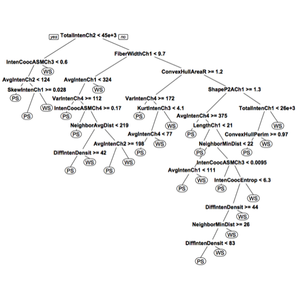 


--- .class #id

## Predicting the Quality of Wine - Part 2
 


--- &twocol
### Predicting the Quality of Wine - Part 3

*** left

 


*** right

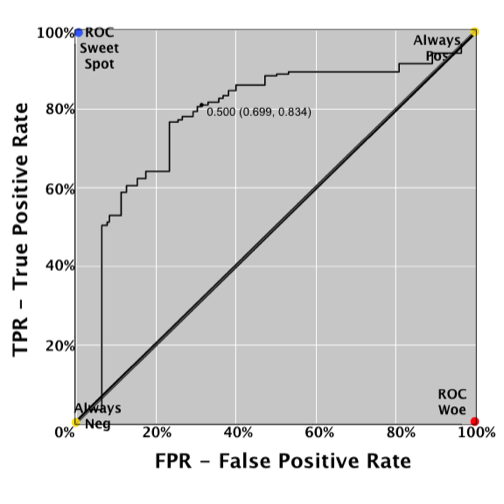 


--- &twocol
### Predicting the Quality of Wine - Part 4 - Problems with Trees

*** left
* Deal with irrelevant inputs
* No data preprocessing required
* Scalable computation (fast to build)
* Tolerant with missing values (little loss of accuracy)
* Only a few tunable parameters (easy to learn)
* Allows for human understandable graphic representation

*** right
* Data fragmentation for high-dimensional sparse data set (over-fitting)
* Difficult to fit to a trend / piece-wise constant model
* Highly influenced by changes to the data set and local optima (deep trees might be questionable as the errors propagate down)


--- .class #id

## Aside - How does a random forest work ?
 


--- &twocol
### Predicting the Quality of Wine - Part 5 - Random Forest

*** left

 


*** right

 


--- &twocol
### Predicting the Quality of Wine - Part 6 - Other ML methods

*** left
*  K-nearest neighbors
  * Unsupervised learning / non-target based learning
  * Distance matrix / cluster analysis using Euclidean distances.
* Neural Nets
  * Looking at basic feed forward simple 3-layer network (input, 'processing', output)
  * Each node / neuron is a set of numerical parameters / weights tuned by the learning algorithm used
  
*** right
* Support Vector Machines
  * Supervised learning
  * non-probabilistic binary linear classifier / nonlinear classifiers by applying the kernel trick
  * constructs a hyper-plane/s in a high-dimensional space


--- .class #id

## Aside - How does k nearest neighbors work ?
 


--- &twocol
### Predicting the Quality of Wine - Part 7 - kNN

*** left

 


*** right

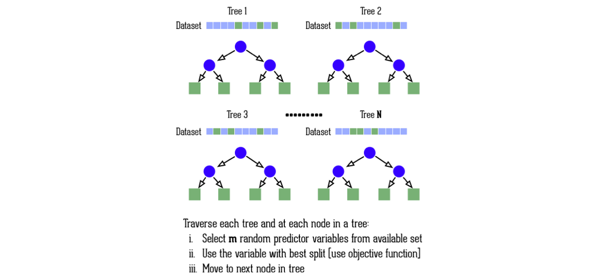 


--- .class #id

## Aside - How do neural networks work ?
 


--- &twocol
### Predicting the Quality of Wine - Part 8 - NNET

*** left

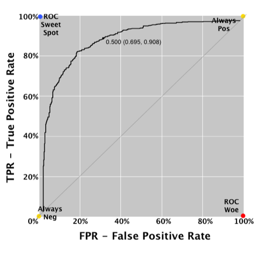 


*** right

 


--- .class #id

## Aside - How do support vector machines work ?
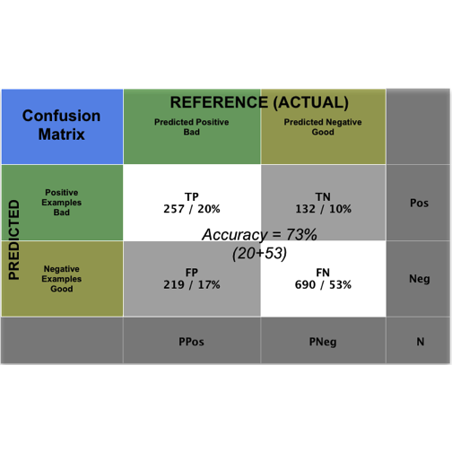 


--- &twocol
### Predicting the Quality of Wine - Part 9 - SVN

*** left

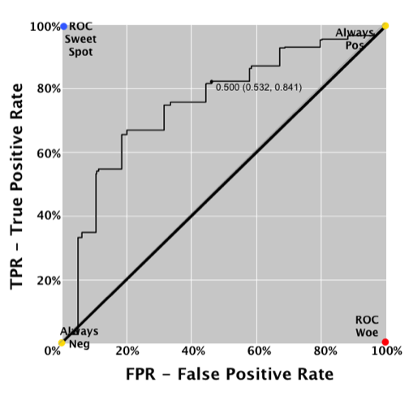 


*** right

 


--- &twocol
### Predicting the Quality of Wine - Part 10 - All Results

*** left

 


*** right

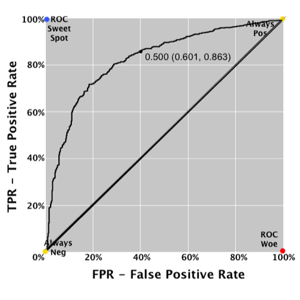 


--- &twocol
## What are they not good for ?
### Predicting the Extramarital Affairs

*** left

* Fair, R.C. et al (1978), models the possibility of affairs, 9 vars with 601 obs (Training = 481 & Test = 120).
* "A Theory of Extramarital Affairs, Fair, R.C., Journal of Political Economy 1978, 86:45-61".
  * Yes (affairs is >= 1 in last 6 months)
  * No (affairs is < 1 in last 6 months)
  

```
## 
##  No Yes 
##  90  30
```


*** right

 


--- &twocol
### Predicting the Extramarital Affairs - RF & NB

*** left
### Random Forest


```
##           Reference
## Prediction No Yes
##        No  90  30
##        Yes  0   0
```

```
## Accuracy 
##     0.75
```


*** right
### Naive Bayes


```
##           Reference
## Prediction No Yes
##        No  88  29
##        Yes  2   1
```

```
## Accuracy 
##     0.75
```


--- &twocol
## Other related tools: OpenRefine (formerly Google Refine) / Rattle


*** left

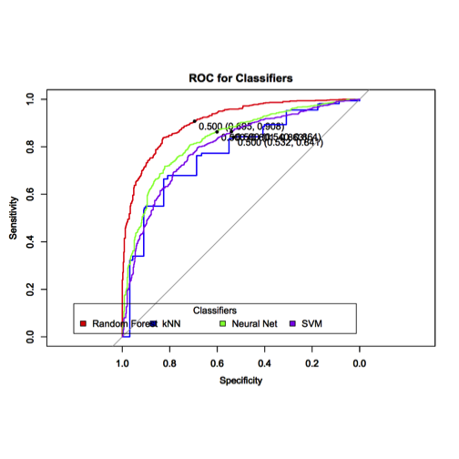 


*** right

 


--- &twocol
## Other related tools: Command Line Utilities

*** left
* [http://www.gregreda.com/2013/07/15/unix-commands-for-data-science/](http://www.gregreda.com/2013/07/15/unix-commands-for-data-science/)
  * sed / awk
  * head / tail
  * wc (word count)
  * grep
  * sort / uniq
* [http://blog.comsysto.com/2013/04/25/data-analysis-with-the-unix-shell/](http://blog.comsysto.com/2013/04/25/data-analysis-with-the-unix-shell/)
  * join
  * Gnuplot

*** right
* [http://jeroenjanssens.com/2013/09/19/seven-command-line-tools-for-data-science.html](http://jeroenjanssens.com/2013/09/19/seven-command-line-tools-for-data-science.html)
  * [http://csvkit.readthedocs.org/en/latest/](csvkit)
  * [https://github.com/jehiah/json2csv](json2csv)
  * [http://stedolan.github.io/jq/](jq - sed for json)
  * [https://github.com/jeroenjanssens/data-science-toolbox/blob/master/sample](sample)
  * [https://github.com/bitly/data_hacks](bitly command line tools)
  * [https://github.com/jeroenjanssens/data-science-toolbox/blob/master/Rio](Rio - csv to r to graphic output)
  * [https://github.com/parmentf/xml2json](xml2json)


--- &twocol
## A (incomplete) tour of the packages in R

*** left
* caret
* party
* rpart
* rpart.plot
* AppliedPredictiveModeling
* randomForest
* corrplot
* arules
* arulesViz


*** right
* C50
* pROC
* corrplot
* kernlab
* rattle
* RColorBrewer
* corrgram
* ElemStatLearn
* car

--- .class #id

## In Summary

### An idea of some of the types of classifiers available in ML.

### What a confusion matrix and ROC means for a classifier and how to interpret them

### An idea of how to test a set of techniques and parameters to help you find the best model for your data

### Slides, Data, Scripts are all on GH:
#### https://github.com/braz/DublinR-ML-treesandforests


